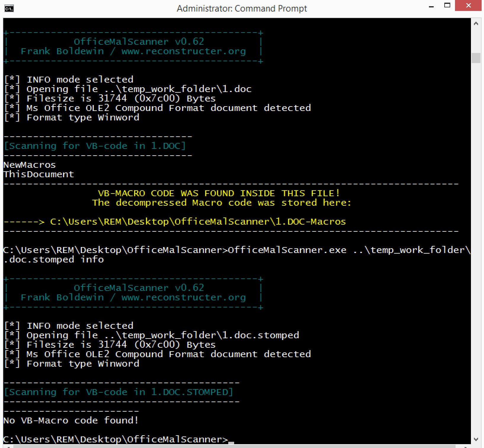

# VBA Stomping

## Overview
"Stomps" a given Office document and creates a new "Stomped" file.

## Installation/Setup
```bash
pip install -r requirements.txt
```

## Usage
```bash
$ python vba_stomp -h 
usage: vba_stomp.py [-h] file

positional arguments:
  file        File to be stomped

optional arguments:
  -h, --help  show this help message and exit
```

```bash
$ python vba_stomp test.doc
[*] Stomped VBA - new file at: test.doc.stomped
```

## Results

